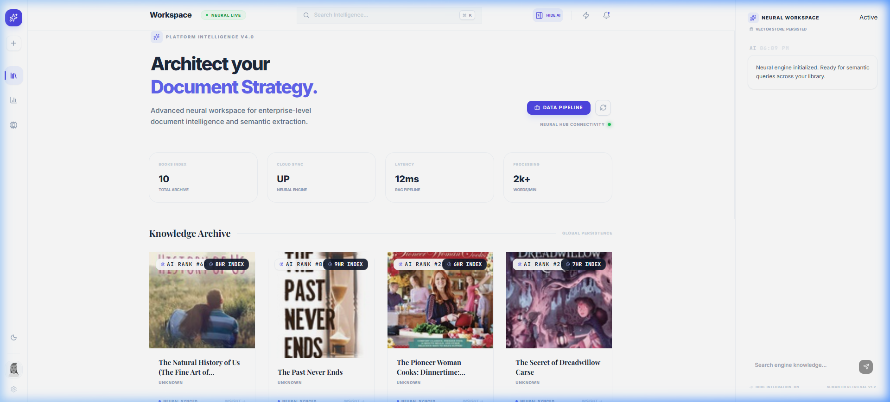
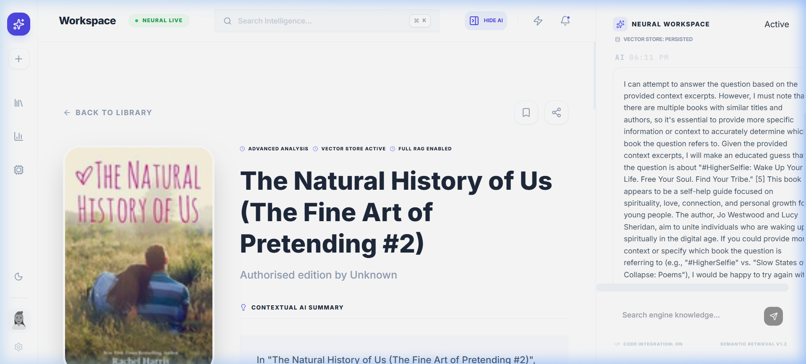
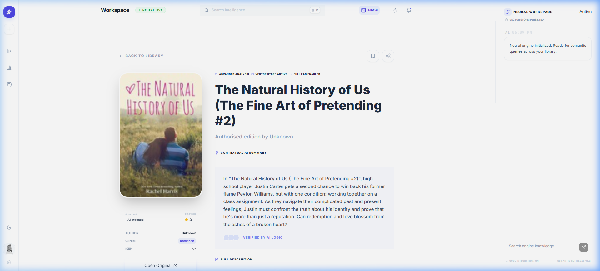

# BookIntel: Document Intelligence Platform

BookIntel is an enterprise-grade document intelligence platform designed to process, analyze, and query literature using state-of-the-art RAG (Retrieval-Augmented Generation). It combines automated data collection, deep AI insights, and a neural vector workspace into a seamless, premium user experience.

## 🖼️ UI Preview


*Modern Bento-style Archive Dashboard*


*Neural Workspace: RAG-powered Q&A with real-time citations*


*AI-driven Book Analytics and Sentiment Insights*


## 🚀 Key Features

- **Hybrid Automation Engine**: 
  - **Selenium Scraper**: High-fidelity web automation for complex data collection.
  - **Requests/BS4 Fallback**: Lightweight fallback for rapid ingestion.
- **Advanced AI Insights**:
  - **Neural Summarization**: Context-aware book summaries.
  - **Zero-Shot Classification**: Automatic genre prediction using LLMs.
  - **Sentiment Mapping**: Analyzes emotional resonance and tonal shifts.
- **RAG Q&A Pipeline**:
  - **Smart Chunking**: Sliding-window strategy with 20% overlap for context preservation.
  - **Neural Retrieval**: Embedding-based similarity search using `all-MiniLM-L6-v2`.
  - **Contextual Generation**: Responses grounded in retrieved sources with **[N] Citations**.
- **Vector-Based Recommendations**: "If you like X, you'll like Y" logic powered by embedding distance.
- **Apple-Inspired Bento UI**: Ultra-modern interface with glassmorphism, fluid animations, and a threaded AI workspace.

## 🛠️ Tech Stack

- **Backend**: Django REST Framework (Python 3.10+)
- **Neural Engine**: Sentence-Transformers, OpenAI / LM Studio (Local LLM support)
- **Vector Store**: High-performance NumPy-based implementation (Windows optimized)
- **Database**: SQLite (Metadata management)
- **Automation**: Selenium with Chrome WebDriver
- **Frontend**: ReactJS, Tailwind CSS, Framer Motion, Lucide Icons

## ⚙️ Setup Instructions

### Prerequisites
- Python 3.10+
- Node.js 18+
- Google Chrome (for Selenium scraping)

### Backend Setup
1. `cd backend`
2. `python -m venv venv`
3. `venv\Scripts\activate` (Windows)
4. `pip install -r requirements.txt`
5. `python manage.py makemigrations`
6. `python manage.py migrate`
7. `python manage.py runserver`

### Frontend Setup
1. `cd frontend`
2. `npm install`
3. `npm start`

### Configuration (`backend/.env`)
```env
OPENAI_API_KEY=your_key_here
USE_LOCAL_LLM=True
LOCAL_LLM_URL=http://localhost:1234/v1
```

## 🔌 API Documentation (REST)

| Endpoint | Method | Description |
|----------|--------|-------------|
| `/api/books/` | GET | List all indexed books (cached) |
| `/api/books/{id}/` | GET | Comprehensive book detail + AI insights |
| `/api/books/scrape_books/` | POST | Trigger Selenium automation engine |
| `/api/books/ask_question/` | POST | RAG-powered semantic query endpoint |
| `/api/books/{id}/recommend/` | GET | Similarity-based related books |

## ❓ Intelligence Samples

**Question**: "What are the common themes in mystery novels available?"  
**Answer**: "Based on the collection, mystery novels like '[Book Name]' often explore themes of [Thematic Insight] [1]. This is contrasted by [Book 2] which focuses on [2]."

---
